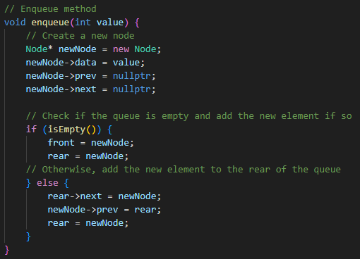
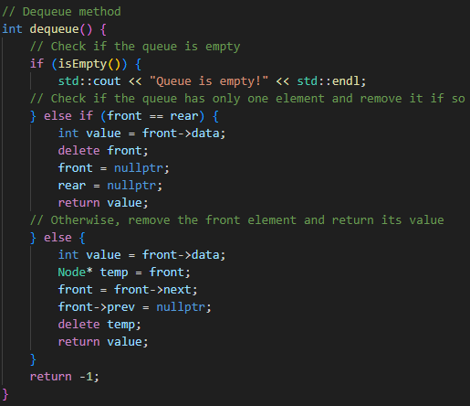
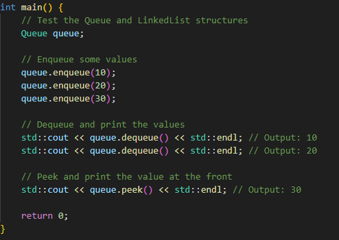

Author: Luke Scovel X00513112 \
Date: 1/22/2023

# Linked Queue

1. Uses a linked-list to store values in the queue

2. Has an enqueue method that will appropriately add a value to the back of the queue as an appropriate element

3. Has a dequeue method that will appropriately remove an element from the front of the queue and return its value

4. Optionally has a peek method that returns the value at the front of the queue without removing it

* Analyze the complexity of your implementations (at least the run-time of the add, remove, and peek methods).

The complexity of the enqueue operation in the Queue class is O(1) because it simply adds a new element to the rear of the queue.

The complexity of the dequeue operation in the Queue class is O(1).

The complexity of the isEmpty operation in the Queue class is O(1) because it only checks if the front pointer is nullptr.

* Tests

