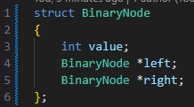
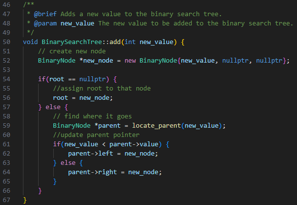
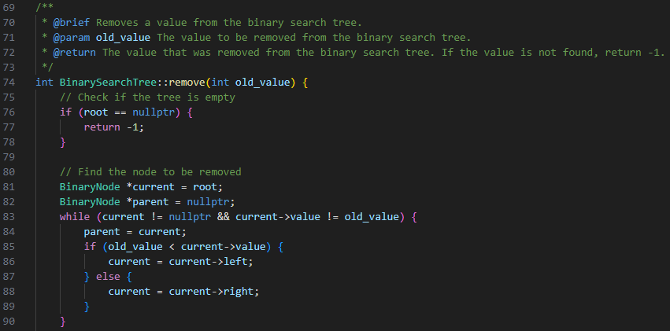
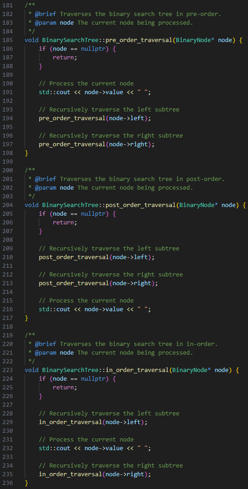

# Binary Search Tree Design

## Node Structure:

#### Variables:
- `value`: The value stored in the node
- `left`: Pointer to the left child node
- `right`: Pointer to the right child node

#### Operations:
- `get_root()`: Gets the Root node
- `locate_parent(value)`: Find the node that would be the parent of the value
- `insert(value)`: Inserts a new node with the given value into the tree
- `search(value)`: Searches for a node with the given value in the tree
- `delete(value)`: Deletes a node with the given value from the tree
- `traverse()`: Traverses the tree in a specific order (e.g., in-order, pre-order, post-order)

## Functions:

#### Add:
1. If the tree is empty, create a new node with the given value and make it the root.
2. If the value is less than the current node's value, go to the left subtree.
3. If the value is greater than the current node's value, go to the right subtree.
4. Repeat steps 2-3 until finding an empty spot.
5. Insert the new node at the empty spot.

#### Remove:
1. Search for the node with the given value.
2. If the node is not found, return.
3. If the node has no children, remove it.
4. If the node has one child, replace the node with its child.
5. If the node has two children, find the minimum value in the right subtree (or maximum value in the left subtree), replace the node's value with it, and delete the duplicate value from the subtree.

#### Searching:
1. Start at the root node.
2. If the value is equal to the current node's value, return the node.
3. If the value is less than the current node's value, go to the left subtree.
4. If the value is greater than the current node's value, go to the right subtree.
5. Repeat steps 2-4 until finding the node or reaching a leaf node.
6. If the node is not found, return null.

#### Traversal:
- In-order traversal: Visit the left subtree, visit the current node, visit the right subtree.
- Pre-order traversal: Visit the current node, visit the left subtree, visit the right subtree.
- Post-order traversal: Visit the left subtree, visit the right subtree, visit the current node.

## Tests:
1. Add numbers to the binary tree based on our ordering rules
2. Check the order with in_order_traversal()
3. Test the search function, see if a value is detected in the tree and see if a wrong value is detected
4. Test the remove function and see if an item is successfully removed
5. Test the traversal functions and see if the order is correct and all elements are as they should be

## Complexity:

#### Insertion Complexity:

In the best case scenario, when the tree is balanced, the time complexity of inserting a new value into a binary search tree is O(log(N)), where N is the number of nodes in the tree. This is because each insertion operation reduces the search space by half, similar to a binary search algorithm.
In the worst case scenario, when the tree is skewed (all nodes are either greater or smaller than the root), the time complexity of insertion becomes O(N), as each insertion operation only reduces the search space by one node.

#### Search Complexity:

In the best case scenario, when the tree is balanced, the time complexity of searching for a value in a binary search tree is O(log(N)), where N is the number of nodes in the tree. This is because each comparison reduces the search space by half, similar to a binary search algorithm.
In the worst case scenario, when the tree is skewed, the time complexity of searching becomes O(N), as each comparison only reduces the search space by one node.

#### Unordered:

In an unordered binary tree the time complexity of both insertion and search operations is O(N) in the worst case scenario. This is because there is no inherent order in the tree, and we may need to traverse all N nodes to find the desired value or determine the correct position for insertion.

## Requirements:

1. nodes to store values,

2. an add function that adds a new value in the appropriate location based on our ordering rules, 
(I likely used less than or equal to going to the left and greater than values going to the right)

3. a remove function that finds and removes a value and then picks an appropriate replacement node,
(successor is a term often used for this)

4. we have at least one tree traversal function (I recommend starting with an in-order traversal!) 
Bonus if you implement the three common traversals (pre-order, post-order, in-order)
More Bonus if you also include a breadth-first traversal (sometimes called a level-order search)

