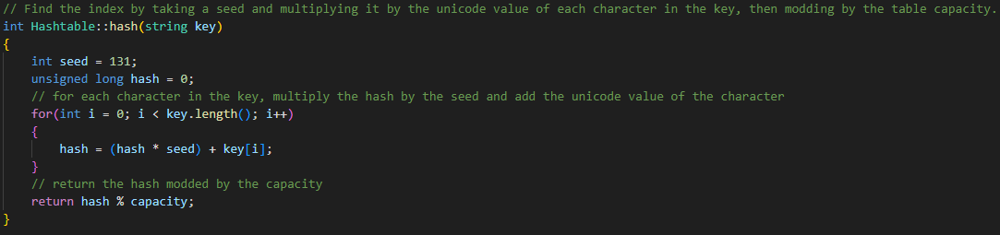
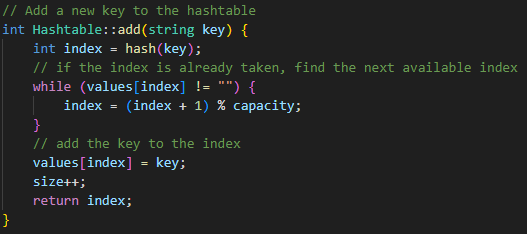
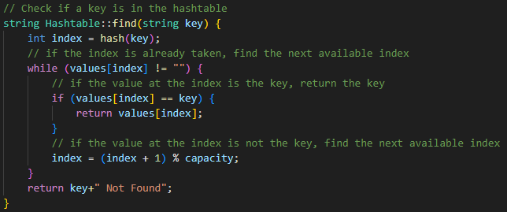
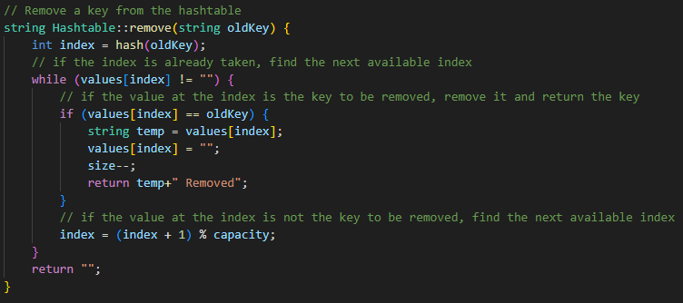
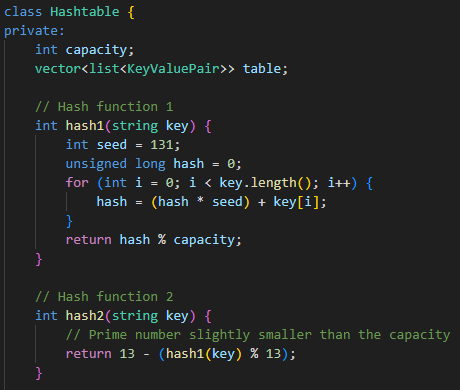

# Hashtable design

## Hashtable Implementation

### Functions:

- `Hashtable(int initialSize)`: Constructor. Initializes the hashtable with the given initial size, setting size to 0 and allocating memory for values.
- `~Hashtable()`: Destructor. Frees the memory allocated for values.
- `int hash(string key)`: Hash function. Computes the index for a given key based on its characters' Unicode values and a seed number.
- `int add(string key)`: Add method. Inserts a new key into the hashtable.
- `string remove(string oldKey)`: Remove method. Deletes a key from the hashtable.
- `string find(string key)`: Find method. Searches for a key in the hashtable.
- `int getSize()`: Returns the number of keys in the hashtable.
- `int getCapacity()`: Returns the capacity of the hashtable.

## Complexity:

#### **Insert Method Complexity:**

- Best Case: O(log n)
- Worst Case: O(n)

As collisions increase, the time complexity of the insert method worsens. Resolving collisions often involves additional steps, such as traversing the chain of elements in the same bucket to find an empty slot or to append the new element, leading to a degradation in time complexity, especially in the worst-case scenario.

#### **Contains Method Complexity:**

- Best Case: O(1)
- Worst Case: O(n)

With frequent collisions, the contains method's time complexity deteriorates. It may require traversing the chain of elements in the same bucket to find the target element, resulting in a longer search time, especially in the worst-case scenario.

## Tests:
1. Check the size of an empty hashtable using getSize() and expects the result to be 0.
2. Verify the default capacity of an empty hashtable using getCapacity() and expect the result to be 16.
3. Searches for the key "hello" in an empty hashtable using find() and expects to receive the message "hello Not Found".
5. Two strings, "hello" and "world", are inserted into the hashtable, and the test verifies that the size of the hashtable is 2 using getSize().
6. After insertion, the test checks the capacity of the hashtable using getCapacity() and expects the result to be 16.
7. Following the insertion, the test searches for the key "hello" in the hashtable and expects to find it.
8. The key "hello" is removed from the hashtable, and the test verifies that the key is no longer found using find().
9. After removal, the test checks the size of the hashtable using getSize() and expects the result to be 1.
10. Finally, the test checks the capacity of the hashtable using getCapacity() after the removal operation and expects the result to be 16.

## Requirements:

- Describe the way that you decide on hashing a value

- An insert function that places the value at the appropriate location based on its hash value

- A contains function that returns whether the value is already in the hashtable

- A delete function that removes a value based on its hash and then returns that value

- A smarter hashtable (double hashing or chaining) including at least the same functions as the simple hashtable

