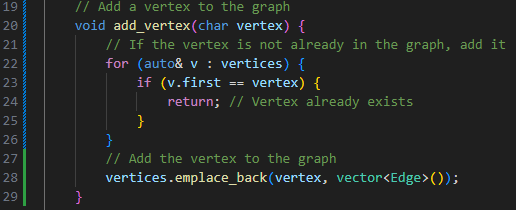
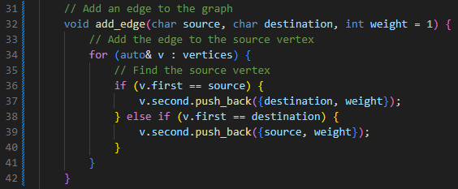
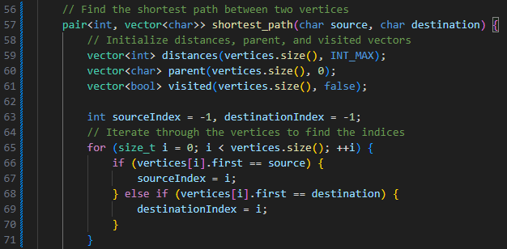
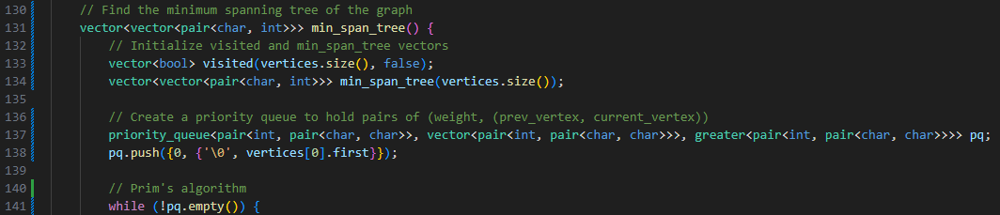

# Graph Class Design

## How a graph could be used to store data and solve a problem

In the context of game development, the game world can be represented as a graph where nodes represent specific locations or positions, and edges represent possible paths or connections between these locations. Each node in the graph corresponds to a specific coordinate or position within the game world.

Finding the shortest path between two points on a map would help AI navigate the world quicker, and a minimum spanning tree would allow for navigation without going in circles.

## Variables:
- `vertices`: A vector to store vertices and their corresponding adjacency lists.

## Public Methods:

### 1. `void add_vertex(char vertex)`
   - Description: Adds a new vertex to the graph if it doesn't exist already.
   - Steps:
     1. Iterate through the vertices to check if the vertex already exists.
     2. If not found, create a new vertex and add it to the graph.

### 2. `void add_edge(char source, char destination, int weight = 1)`
   - Description: Adds a new edge between two vertices of the graph.
   - Parameters:
     - `source`: The source vertex of the edge.
     - `destination`: The destination vertex of the edge.
     - `weight` (optional): The weight of the edge. Default is 1.
   - Steps:
     1. Check if both source and destination vertices exist in the graph.
     2. If found, add the edge between the vertices with the specified weight.

### 3. `pair<int, vector<char>> shortest_path(char source, char destination)`
   - Description: Finds the shortest path between two vertices using Dijkstra's algorithm.
   - Parameters:
     - `source`: The starting vertex.
     - `destination`: The destination vertex.
   - Returns:
     - A pair containing the shortest distance and the path as a vector of characters.
   - Steps:
     1. Initialize distances and parent map.
     2. Set all distances to infinity.
     3. Create a priority queue to hold pairs of (distance, vertex).
     4. Apply Dijkstra's algorithm to find the shortest path.
     5. Reconstruct the shortest path and return the result.

### 4. `vector<vector<pair<char, int>>> min_span_tree()`
   - Description: Finds the minimum spanning tree of the graph using Prim's algorithm.
   - Returns:
     - An unordered map representing the minimum spanning tree.
   - Steps:
     1. Initialize an empty minimum spanning tree (MST) represented as an unordered map with characters as keys and vectors of pairs (char, int) as values.
     2. Initialize a set to keep track of visited vertices.
     3. Initialize a priority queue to store edge weights and their corresponding vertices.
     4. Select a starting vertex arbitrarily and mark it as visited.
     5. Add all edges connected to the starting vertex to the priority queue.
     6. Loop while the priority queue is not empty:
     7. Return the minimum spanning tree.

## Test Examples
- Test Case 1: Adding a New Vertex
- Test Case 2: Adding Existing Vertex
- Test Case 3: Adding a New Edge
- Test Case 4: Adding Existing Edge
- Test Case 5: Shortest Path Exists
- Test Case 6: Shortest Path Doesn't Exist
- Test Case 7: Minimum Spanning Tree Exists
- Test Case 8: No Minimum Spanning Tree (Graph Disconnected)

## Complexity:

#### Shortest Path Algorithms (e.g., Dijkstra's Algorithm):
- Time Complexity: O((V + E) log V), where V is the number of vertices and E is the number of edges in the graph.
- Space Complexity: O(V), where V is the number of vertices.

#### Minimum Spanning Tree Algorithms (e.g., Prim's Algorithm, Kruskal's Algorithm):
- Time Complexity: O(E log V), where V is the number of vertices and E is the number of edges in the graph.
- Space Complexity: O(V), where V is the number of vertices.

#### Graph Traversal Algorithms (e.g., Depth-First Search, Breadth-First Search):
- Time Complexity: O(V + E), where V is the number of vertices and E is the number of edges in the graph.
- Space Complexity: O(V), where V is the number of vertices.

#### Adding Vertices/Edges
- O(1)

## Requirements:

- A function to add a new vertex to the graph (perhaps add_vertex(vertex_name)),

- A function to add a new edge between two vertices of the graph (perhaps add_edge(source, destination) or source.add_edge(destination)),

- A function for a shortest path algorithm (perhaps shortest_path(source, destination)),

- A function for a minimum spanning tree algorithm (example min_span_tree()).

